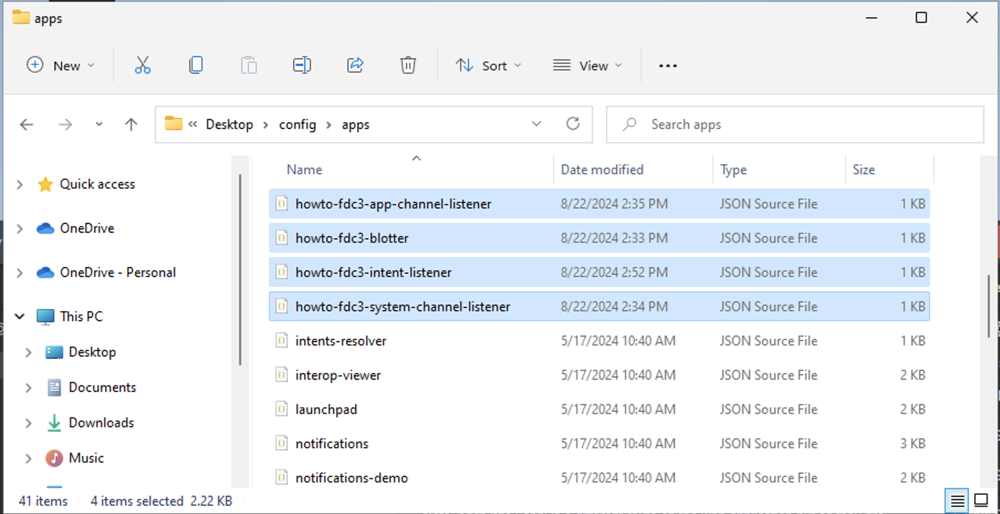
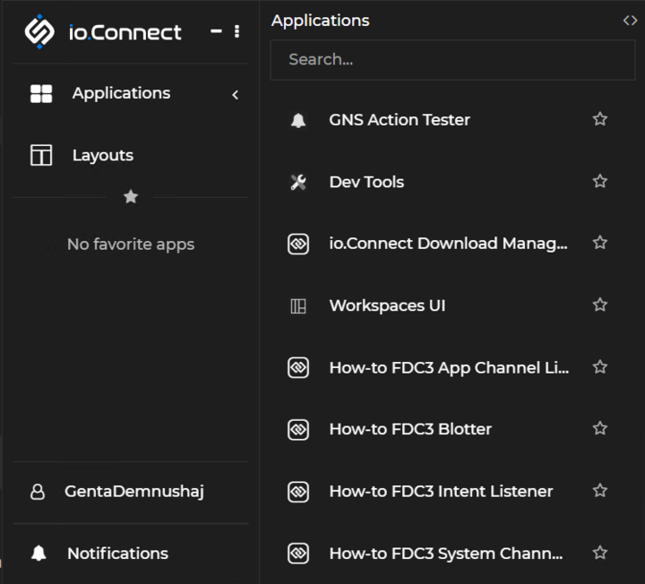
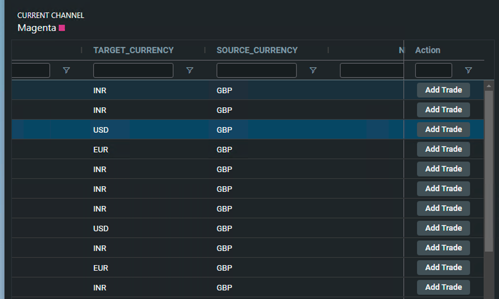
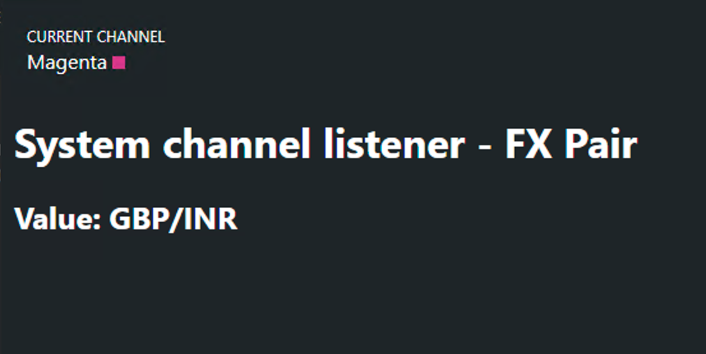
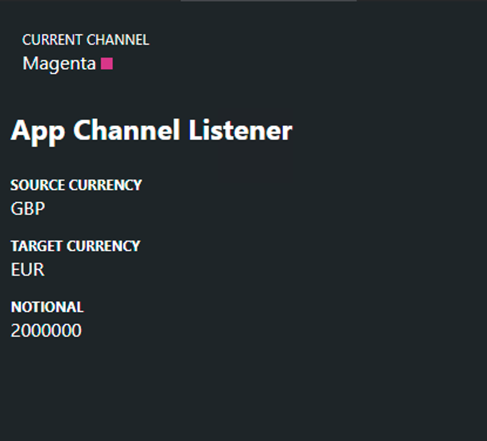

# FDC3 Web Client

This application has been generated using Genesis Create and has been adapted to demonstrate the features of `foundation-fdc3` library.

It serves several 'fdc3-apps' that leverage FDC3 interop features to interact with each other.

Note, each 'fdc3-app' is a different route on the web application but as they are loaded in a different Desktop Agent container. In a real life situation, your apps will have different origins.

# Development

1. Install dependencies:

```shell
npm run bootstrap
```

2. Start Web development server in watch mode:

```shell
npm run dev
```

3. Build for production:

```shell
npm run build
```

Preview production build:

```shell
npm run serve
```

## Running in Desktop Agent

An FDC3 Desktop Agent is a desktop component (or aggregate of components) that serves as an orchestrator for applications in its domain.

You can read more about [FDC3 Desktop Agents](https://fdc3.finos.org/docs/api/ref/DesktopAgent) here.

If you are using Interop IO.Connect you need to configure the agent in order for it to be auto-inject the global `window.fdc3` which is required for this example.

To do this, in `C:\Users\**user-name**\AppData\Local\interop.io\io.Connect Desktop\Desktop\config\system.json` file you need to add (or replace if it already exists) the `autoInjectFdc3` config property.

Make sure you save your changes.

```json
{
  ...
  "windows": {
    ...
    "autoInjectFdc3": {
      "enabled": true,
      "version": "*",
      "channels": true
    },
    ...
  }
}
```

## Configure FDC3 App Directory

In this example there are four "fdc3 apps". Each one has its own app directory config file.

To save you running four different instances of the Genesis server, each app uses a different routes in the same web application.

The app directory config files for IO.Connect are in [Interop config](./client/fdc3-config/interop/) folder. Copy them to `C:\Users\**user-name**\AppData\Local\interop.io\io.Connect Desktop\Desktop\config\apps`.

The app urls are set to run from localhost:6060/**app-name**. If your app is not running from localhost:6060 update the url in the fdc3 config files accordingly.

### Application List

The four applications in this example are:

- `howto-fdc3-blotter`: an app with a grid listing trades. When the row is clicked, a message is sent on the system color channel with `fdc3.instrument` type. There is a button to add a trade which raises the `CreateTrade` intent when clicked.
- `howto-fdc3-intent-listener`: Launched by and listens to the `CreateTrade` intent with `fdc3.instrument` context. It contains a form for submitting a trade and is pre filled by the some intent data.
- `howto-fdc3-app-channel-listener`: Listens to the `genesis.fxpair` type on the system color channel.
- `howto-fdc3-system-channel-listener`: Listens to the `genesis.fxtrade` type on the specified custom channel `customAppChannel`.

When added, you will see the files in the folder along with whatever other existing applications.



You can then select your apps in the Io.Connect floating window in the `Applications` section e.g. '**How-to-FDC3 Blotter**'. Note you will have to login each time you open an application.



## Starting Genesis Applications

Ensure the Genesis Services and Web Application are running and healthy before you proceed to the next steps. Follow the steps on [Quick Start](https://docs.genesis.global/docs/develop/development-environments/) for more details.

The desktop agent will load applications with the url specified in their app directory config files. Each url matches a route on the web application.

## FDC3 Apps Overview

There are 4 applications which interoperate using the foundation-fdc3 library. Each application has a color picker to select system channels (for that application only)

### howto-fdc3-blotter
The blotter displays a list of trades. The code can be found [here](./client/src/routes/blotter/). Each row in the grid has a button to raise a `CreateTrade` intent.

When a row is clicked the application sends a message on an app channel with type `genesis.fxtrade` - the whole row object - and a message on the color channel with `genesis.fxpair` - use the `mappingFunction` to create and send an object with source and target currency values.

This is done by using `<fdc3-channel-event></fdc3-channel-event>` as a child element of the parent `<rapid-grid-pro></rapid-grid-pro>` element and specifying the event-name. To broadcast on a specific app channel the `channel-name` is specified on one of the elements.

[Blotter template](./client/src/routes/blotter/blotter.template.ts)
```html
<rapid-grid-pro
    persist-filter-model-key="grid-pro-all-positions"
>
    <fdc3-channel-event
        event-name="rowClicked"
        channel-type="genesis.fxpair" 
        :mappingFunction="${() => ({SOURCE_CURRENCY, TARGET_CURRENCY}) => ({ id: { SOURCE_CURRENCY, TARGET_CURRENCY }})}"
    >
    </fdc3-channel-event>
    <fdc3-channel-event
        event-name="rowClicked"  
        channel-type="genesis.fxpair"
        channel-name="customAppChannel" 
        :mappingFunction="${() => ({SOURCE_CURRENCY, TARGET_CURRENCY, NOTIONAL}) => ({ id: { SOURCE_CURRENCY, TARGET_CURRENCY, NOTIONAL }})}"
    >
    </fdc3-channel-event>
  ...
```

Note that you can listen to any event emitted by any parent element.

The intent is raised using the `FDC3` service from foundation-fdc3 library. In the trade button column definition, we invoked the method in the click handler to raise the intent.

[Blotter class](./client/src/routes/blotter/blotter.template.ts)
```ts
...
cellRendererParams: {
  actionClick: async (rowData) => {
    this.fdc3.raiseIntent(
      {
        id: rowData,
        type: 'fdc3.instrument',
      },
      'CreateTrade' as FDC3Intents,
    );
  }, 
  actionName: 'Add Trade',
  appearance: 'primary-gradient',
},
...
```

### intent-listener
The intent listener handles the `CreateTrade` intent raised by the blotter application and partly fills a form with the intent payload. 

The app is opened by raising the intent (so you don't need to open it yourself via the floating menu). You can find the source files [here](./client/src/routes/intent-listener).

Intents need to be handled within 30 seconds so the intent is handled in the top level [main.template.ts](./client/src/main/main.template.ts) using the `<fdc3-intent-listener></fdc3-intent-listener>` component. (this code will be run even if not authenticated)

[main.template.ts](./client/src/main/main.template.ts)
```html
<fdc3-intent-listener :intentConfig="${x => [
    { 
        intent: 'CreateTrade', 
        callback: intentPayload => x.handleTicketIntent(intentPayload) 
    },
]}">
</fdc3-intent-listener>
...
```

[main.ts](./client/src/main/main.ts)
```ts
...
handleTicketIntent(message): void {
  this.$emit(StoreEvents.OpenTradeTicket, message.id);
  Route.path.push('/intent-listener');
}
...
```

When the `intent-listener` route is loaded it retrieves the value from the store and populates the form.

 
[intent-listener.ts](./client/src/routes/intent-listener/intent-listener.ts)
```ts
...
if (this.store.trade) {
  this.setFormData(this.store.trade);
}

this.store.binding(
  (s) => s.trade,
  (instrument) => {
    this.tradeSuccess = false;
    this.setFormData(instrument);
  },
);
...
```

### system-channel-listener
The [system-channel-listener](./client/src/routes/system-channel-listener/system-channel-listener.ts) application uses the `<fdc3-system-channel-listener></fdc3-system-channel-listener>` component to listen to the system color channel for events with channel type of `genesis.fxpair`.

This application needs to be started manually as it uses channels, not intents.

```html
...
<fdc3-system-channel-listener :config="${x => [
  {
    channelType: 'genesis.fxpair',
    callback: message => x.handleChannelMessage(message)  
  }
]}"></fdc3-system-channel-listener>
...
```
Channel messages will only be received when the blotter and system channel applications have the same color channel selected. When a message is received the handler creates a string for the fx pair from the message payload.
```ts
...
handleChannelMessage(message: Context): void {
  this.fxPair = `${message.id.SOURCE_CURRENCY}/${message.id.TARGET_CURRENCY}`;
}
...
```





### app-channel-listener
The [app-channel-listener](./client/src/routes/app-channel-listener/app-channel-listener.ts) application uses the `<fdc3-context-listener></fdc3-context-listener>` wep component to listen to the `customAppChannel` for events with channel type of `genesis.fxtrade`.

This application needs to be started manually as it uses channels, not intents.

As this is an [app channel](https://fdc3.finos.org/docs/api/spec#app-channels) the selected color channel has no effect if messages are received or not. If the app is open and the blotter is clicked the application will receive the message. 

```html
...
<fdc3-context-listener :config="${x => [
  {
    channelType: 'genesis.fxtrade', 
    channelName: 'customAppChannel', 
    callback: message => x.handleChannelMessage(message) 
  }
]}">
</fdc3-context-listener>
...
```

```ts
...
handleChannelMessage(message: Context): void {
  this.fxTradeDetails = Object.keys(message.id)
    .map(label => ({
      label: convertSnakeToCamel(label),
      value: message.id[label]
    }));
}
...
```

When a message is received the application iterates through the `id` property to create an array of key value pairs. These are rendered in the template.


# Test results
BDD test results can be found [here](https://genesiscommunitysuccess.github.io/howto-fdc3/test-results)
